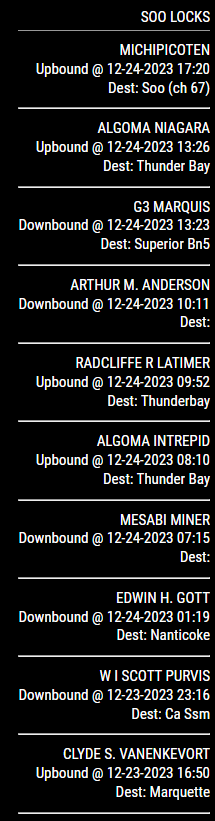

# MMM-SooLocks

This is a module for the [MagicMirror²-Project](https://github.com/MichMich/MagicMirror/).

It displays current ship information for the Soo Locks

## Example



## Installation

Assuming `~/MagicMirror` is the directory where you installed MagicMirror².

### Clone and install

```bash
cd ~/MagicMirror/modules
git clone https://github.com/chicklets921/MMM-SooLocks.git
```

### Update your config.js file

Add a configuration block to the modules array in the `~/MagicMirror/config/config.js` file:

```js
var config = {
    modules: [
        {
            module: 'MMM-SooLocks',
            position: 'top_right',
            config: {
                showImages: true,
                numberOfShips: 5,
                fetchInterval: 30 * 60 * 1000,
                maxRetries: 3,
                retryDelay: 60 * 1000,
            },
        },
    ],
};
```

### Configuration Options

| Option | Default | Description |
|--------|---------|-------------|
| `showImages` | `false` | Show vessel images when available. |
| `numberOfShips` | `5` | Number of ships to display. |
| `fetchInterval` | `30 * 60 * 1000` | How often to refresh data (in ms). |
| `maxRetries` | `3` | Maximum number of fetch retries on failure. |
| `retryDelay` | `60 * 1000` | Initial delay (ms) before a retry; doubles after each failure. |

On a failed fetch the module will retry using exponential backoff. Progress
messages such as "Retrying in 60s..." will be displayed on the frontend while
waiting between attempts. After `maxRetries` attempts the module stops retrying
until the next scheduled refresh.

This is the only config setup for now. More features may be added in the future.

## Update to new versions

Assuming `~/MagicMirror` is the directory where you installed MagicMirror².

```bash
cd ~/MagicMirror/modules/MMM-SooLocks
git pull
```

## Known issues and limitations

-   Little to no error handing for now but that will be added soon
