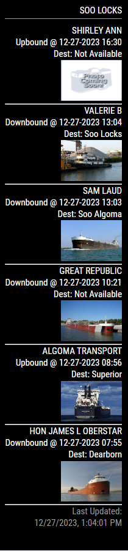

# MMM-SooLocks

This is a module for the [MagicMirror²-Project](https://github.com/MichMich/MagicMirror/).

It displays current ship information for the Soo Locks

## Example



## Installation

Assuming `~/MagicMirror` is the directory where you installed MagicMirror².

### Clone and install

```bash
cd ~/MagicMirror/modules
git clone https://github.com/chicklets921/MMM-SooLocks.git
```

### Update your config.js file

Add a configuration block to the modules array in the `~/MagicMirror/config/config.js` file:

```js
var config = {
    modules: [
        {
            module: 'MMM-SooLocks',
            position: 'top_right',
            config: {
                showImages: true,
                numberOfShips: 5,
                fetchInterval: 30 * 60 * 1000,
                fetchTimeout: 10 * 1000,
            },
        },
    ],
};
```
The `fetchTimeout` option controls how long the helper waits before aborting a
stalled request. When a request is aborted, the helper immediately sends a
`FETCH_RETRY` notification so the module can retry without waiting for the
next `fetchInterval`.

## Update to new versions

Assuming `~/MagicMirror` is the directory where you installed MagicMirror².

```bash
cd ~/MagicMirror/modules/MMM-SooLocks
git pull
```

## Known issues and limitations

-   Little to no error handing for now but that will be added soon